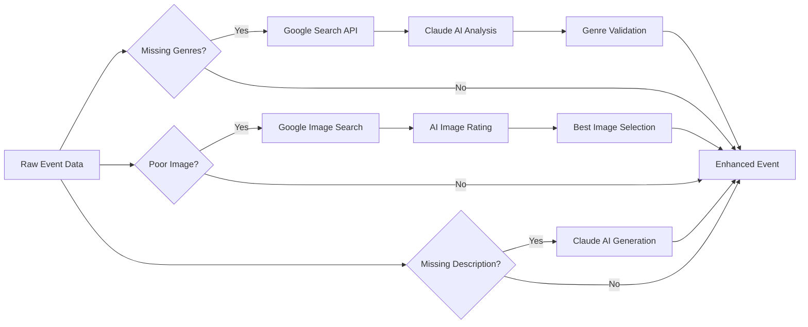

# Event Importer

A Model Context Protocol (MCP) server that imports structured event data from various sources including direct API access, web scraping, and image extraction.

## Features

- **Multiple Import Methods**:
  - **API Import**: Direct access to Resident Advisor GraphQL and Ticketmaster Discovery APIs
  - **Web Import**: Smart web scraping with HTML and screenshot fallback
  - **Image Import**: Extract event details from flyers and posters using vision AI
  
- **Intelligent Enhancement**:
  - **[Genre Enhancement](docs/GENRE_ENHANCER.md)**: Automatic genre discovery using Claude AI + Google Search
  - **[Image Enhancement](docs/IMAGE_ENHANCER.md)**: Find high-quality event images using AI-powered search and rating
  - AI-powered description generation when missing
  - Structured data validation with Pydantic
  - Real-time progress tracking for long-running imports

- **CLI**:
  - Facilitates local testing

- **MCP Integration**:
  - Full Model Context Protocol server implementation for use with AI assistants

## Augmented Data Intelligence

The Event Importer doesn't just extract data—it **enhances** it using AI and web search:

### **Smart Genre Discovery**

When events lack genre information, the system:

1. **Searches Google** for artist information from authoritative music sources
2. **Uses Claude AI** to analyze and extract primary music genres  
3. **Validates** against a comprehensive music genre database
4. **Enhances** events with accurate, searchable genre tags

**Example**: `"Cursive at Zebulon"` → Searches Google → Finds Wikipedia/Discogs data → Claude extracts `["indie rock", "alternative rock"]`

[Read the Genre Enhancer Documentation](docs/GENRE_ENHANCER.md)

### **Intelligent Image Enhancement**

For web-scraped events with poor images, the system:

1. **Searches Google Images** using smart queries built from event data
2. **Downloads and analyzes** multiple image candidates  
3. **Uses AI-powered rating** considering size, aspect ratio, and source credibility
4. **Selects the best** high-quality, event-appropriate image

**Example**: Low-quality venue screenshot → Searches `"Artist band photo"` → Finds high-res Spotify image → Rates and selects best candidate

[Read the Image Enhancer Documentation](docs/IMAGE_ENHANCER.md)

### **AI-Powered Content Generation**

Claude AI generates missing event descriptions:

- **Long descriptions**: Comprehensive, natural summaries using all available event data
- **Short descriptions**: Factual, under-100-character summaries for cards and previews
- **Context-aware**: Incorporates lineup, venue, genres, and event details

## Installation

### Prerequisites

- Python 3.10+
- [uv](https://github.com/astral-sh/uv) package manager ([installation instructions](https://docs.astral.sh/uv/getting-started/installation/))

### Setup

1. Clone the repository:

   ```bash
   git clone https://github.com/yourusername/event-importer.git
   cd event-importer
   ```

2. Install dependencies:

   ```bash
   uv sync
   ```

3. Configure environment variables:

   ```bash
   cp .env.example .env
   ```

   Edit `.env` with your API keys:

   ```env
   # Required
   ANTHROPIC_API_KEY=your_anthropic_api_key
   ZYTE_API_KEY=your_zyte_api_key
   
   # Optional (enables additional features)
   TICKETMASTER_API_KEY=your_ticketmaster_consumer_key
   GOOGLE_API_KEY=your_google_api_key
   GOOGLE_CSE_ID=your_google_custom_search_engine_id
   ```

### Getting API Keys

- **Anthropic**: Sign up at [console.anthropic.com](https://console.anthropic.com)
- **Zyte**: Get web scraping API access at [zyte.com](https://www.zyte.com)
- **Ticketmaster**: Register for free at [developer.ticketmaster.com](https://developer.ticketmaster.com)
- **Google Search**: Set up Custom Search at [developers.google.com/custom-search](https://developers.google.com/custom-search) (enables Genre + Image Enhancement)

## Usage

### As an MCP Server

1. Run the server directly:

   ```bash
   uv run event-importer
   ```

2. Or configure in your MCP client (e.g., Claude Desktop):

   ```json
   {
     "mcpServers": {
       "event-importer": {
         "command": "uv",
         "args": ["run", "event-importer"],
         "cwd": "/path/to/event-importer"
       }
     }
   }
   ```

### Using the MCP Tool

Once connected, use the `import_event` tool:

```json
{
  "tool": "import_event",
  "arguments": {
    "url": "https://ra.co/events/1234567",
    "force_method": "api",  // Optional: "api", "web", or "image"
    "include_raw_data": false,
    "timeout": 60
  }
}
```

### Testing

Run the test scripts:

```bash
# Test with example URLs
uv run python scripts/test_importer.py

# Test specific URL
uv run python scripts/test_importer.py "https://ra.co/events/1234567"

# Test URL analyzer
uv run python scripts/test_url_analyzer.py

# Test Genre Enhancement (requires Google Search API)
uv run python scripts/test_genre_enhancer.py

# Test Image Enhancement (requires Google Search API)  
uv run python scripts/test_image_enhancer.py

# Confirm Google Search API works
uv run python scripts/test_google_custom_search_api.py

# Test error capture system
uv run python scripts/test_error_capture.py

# Explore RA.co API
uv run scripts/test_ra_api.sh
```

## Supported Sources

### 1. Resident Advisor (RA.co)

- **URLs**: `https://ra.co/events/1234567`
- **Method**: Direct GraphQL API
- **No API key required**
- **Features**: Full event details, lineup, genres, venue information
- **Enhancement**: Genre and description generation when data is missing

### 2. Ticketmaster & Affiliates

- **URLs**: `ticketmaster.com`, `livenation.com`, `ticketweb.com`
- **Method**: Discovery API v2
- **Requires API key** (free tier: 5000 requests/day)
- **Features**: Pricing, venue details, high-res images
- **Enhancement**: Genre discovery and description generation

### 3. Direct Image URLs

- **Formats**: `.jpg`, `.jpeg`, `.png`, `.gif`, `.webp`
- **Method**: Vision AI extraction using Claude
- **Best for**: Event flyers and posters
- **Features**: Extracts text, dates, lineup from visual content
- **Enhancement**: Automatic description generation from extracted data

### 4. Any Other Event Page

- **Method**: Intelligent web scraping with Zyte
- **Process**: HTML extraction → Screenshot fallback → **Image enhancement** → **Genre discovery**
- **Features**: Universal fallback for any event website
- **Enhancement**: Full AI-powered enhancement pipeline

## Output Schema

The importer returns structured event data with intelligent enhancements:

```python
{
  "title": "Event Name",  # Required
  "venue": "Venue Name", 
  "date": "2024-12-31",  # ISO format
  "time": {
    "start": "22:00",
    "end": "04:00"
  },
  "lineup": ["Artist 1", "Artist 2"],
  "promoters": ["Promoter Name"],
  "genres": ["Electronic", "House"],  # ← Enhanced via AI + Google Search
  "long_description": "Full event description...",  # ← Generated by Claude AI
  "short_description": "Brief factual summary under 100 chars",  # ← Generated by Claude AI
  "location": {
    "address": "123 Main St",
    "city": "Los Angeles",
    "state": "CA",
    "country": "United States",
    "coordinates": {"lat": 34.0522, "lng": -118.2437}
  },
  "images": {  # ← Enhanced via AI + Google Search
    "full": "https://high-quality-image-found-by-ai.jpg",
    "thumbnail": "https://high-quality-image-found-by-ai.jpg"
  },
  "image_search": {  # Enhancement tracking
    "original": {"url": "...", "score": 75, "source": "original"},
    "candidates": [...],
    "selected": {"url": "...", "score": 150, "source": "google_search"}
  },
  "minimum_age": "21+",
  "cost": "$20",
  "ticket_url": "https://...",
  "source_url": "https://...",
  "imported_at": "2024-01-01T00:00:00Z"
}
```

## Architecture

```plaintext
event-importer/
├── app/
│   ├── __init__.py          # Package exports and version
│   ├── main.py              # MCP server entry point
│   ├── config.py            # Configuration management
│   ├── errors.py            # Custom exceptions and error handling
│   ├── http.py              # Centralized HTTP client with session pooling
│   ├── schemas.py           # Pydantic data models
│   ├── url_analyzer.py      # URL type detection and routing
│   ├── agent.py             # Base agent class
│   ├── importer.py          # Import orchestration
│   ├── progress.py          # Real-time progress tracking
│   ├── router.py            # Request routing
│   ├── prompts.py           # Modular Claude prompt templates
│   ├── services/            # External service integrations
│   │   ├── __init__.py
│   │   ├── claude.py        # Claude AI extraction with tools
│   │   ├── image.py         # Image validation, search & enhancement 🤖
│   │   ├── genre.py         # Genre discovery & enhancement 🤖
│   │   └── zyte.py          # Web scraping with retries
│   ├── agents/              # Import agents by source type
│   │   ├── __init__.py
│   │   ├── ra_agent.py      # Resident Advisor GraphQL
│   │   ├── ticketmaster_agent.py # Ticketmaster Discovery API
│   │   ├── web_agent.py     # Generic web scraping + enhancement 🤖
│   │   └── image_agent.py   # Direct image extraction
│   ├── data/                # Reference data and utilities
│   │   ├── __init__.py
│   │   └── genres.py        # Music genre validation & normalization 🤖
│   └── cli/                 # CLI interface system
│       ├── __init__.py
│       ├── core.py          # Main CLI class
│       ├── theme.py         # Unified theme system
│       ├── components.py    # Reusable UI components
│       ├── formatters.py    # Complex data formatters
│       ├── utils.py         # Helper functions
│       └── error_capture.py # Error capture system
├── scripts/                 # Utility and test scripts
│   ├── test_importer.py     # Main testing script
│   ├── test_url_analyzer.py # URL analyzer tests
│   ├── test_genre_enhancer.py # Genre enhancement tests 🤖
│   ├── test_image_enhancer.py # Image enhancement tests 🤖
│   ├── test_google_custom_search_api.py # Google API verification
│   ├── test_error_capture.py # Error capture system test
│   └── test_ra_api.sh       # RA.co API exploration
├── docs/                    # Additional documentation
│   ├── GENRE_ENHANCER.md    # Genre enhancement deep dive 🤖
│   └── IMAGE_ENHANCER.md    # Image enhancement deep dive 🤖
├── pyproject.toml           # Project dependencies and metadata
├── .gitignore               # Git ignore patterns
├── .env.example             # Environment template
└── README.md                # This file
 
```

🤖 = AI Enhancement Features

## Key Features

### Intelligent Import Flow

1. **URL Analysis**: Determines source type and best import method
2. **Agent Selection**: Routes to appropriate specialized agent
3. **Progressive Enhancement**:
   - API agents: Direct data → **AI description generation** → **Genre discovery**
   - Web agent: HTML → Screenshot → **Image enhancement** → **Genre discovery**
4. **Data Validation**: Pydantic models with smart parsing
5. **Progress Tracking**: Real-time updates for long operations

### AI-Powered Enhancement Pipeline



### Error Handling

- **Retry Logic**: Exponential backoff for transient failures
- **Graceful Degradation**: Falls back to simpler methods
- **Enhancement Isolation**: Core import succeeds even if enhancement fails
- **Detailed Logging**: Comprehensive error context
- **Timeout Protection**: Configurable per-request timeouts
- **Clean Display**: Errors captured and shown at end, not interrupting progress

### Data Processing

- **HTML Sanitization**: Removes scripts and styles using `nh3`
- **Smart Text Extraction**: Handles various date/time formats
- **AI Description Generation**: Claude creates missing descriptions using all available data
- **Genre Discovery**: Searches and validates music genres automatically
- **Image Enhancement**: Finds and rates high-quality event images

### CLI System

- **Unified Theme**: Consistent visual design across all output
- **Progress Tracking**: Clean progress bars and status updates
- **Error Capture**: Collects log messages and displays them organized at the end
- **Rich Formatting**: Tables, syntax highlighting, and structured output

## Configuration

### Environment Variables

```bash
# Required for all imports
ANTHROPIC_API_KEY=sk-ant-...     # Claude AI for extraction and enhancement
ZYTE_API_KEY=...                 # Web scraping infrastructure

# Optional - Enable specific features
TICKETMASTER_API_KEY=...         # Ticketmaster imports
GOOGLE_API_KEY=...               # Genre + Image enhancement
GOOGLE_CSE_ID=...                # Google Custom Search Engine ID

# Advanced Settings
HTTP_TIMEOUT=30                  # Request timeout in seconds
HTTP_MAX_RETRIES=3               # Retry attempts
ZYTE_USE_RESIDENTIAL_PROXY=false # For heavily protected sites
ZYTE_GEOLOCATION=US              # Geolocation for requests
ZYTE_JAVASCRIPT_WAIT=5           # Seconds to wait for JS rendering
DEBUG=false                      # Enable debug logging
LOG_LEVEL=INFO                   # Logging verbosity
```

### Features by Configuration

| Feature           | Required Keys                                            | Description                                     |
| ----------------- | -------------------------------------------------------- | ----------------------------------------------- |
| Resident Advisor  | None (always available)                                  | GraphQL API, no auth needed                     |
| Ticketmaster      | `TICKETMASTER_API_KEY`                                   | Official Discovery API v2                       |
| Genre Enhancement | `GOOGLE_API_KEY` + `GOOGLE_CSE_ID` + `ANTHROPIC_API_KEY` | AI-powered genre discovery using web search     |
| Image Enhancement | `GOOGLE_API_KEY` + `GOOGLE_CSE_ID` + `ANTHROPIC_API_KEY` | AI-powered high-quality image search and rating |
| Web Scraping      | `ZYTE_API_KEY`                                           | Cloud browser for any website                   |
| Vision AI         | `ANTHROPIC_API_KEY`                                      | Extract from images/screenshots                 |

## Development

### Running Tests

```bash
# Manual testing with example URLs
uv run python scripts/test_importer.py

# Test specific functionality
uv run python scripts/test_url_analyzer.py
uv run python scripts/test_error_capture.py

# Test AI Enhancement Features 🤖
uv run python scripts/test_genre_enhancer.py     # Genre discovery
uv run python scripts/test_image_enhancer.py     # Image enhancement

# Explore RA.co API
uv run scripts/test_ra_api.sh
```

### Project Structure

The codebase follows these design patterns:

- **Strategy Pattern**: Agent-based architecture for different sources
- **Factory Pattern**: Dynamic agent creation based on configuration
- **Singleton Pattern**: Shared HTTP client and configuration
- **Decorator Pattern**: Error handling and retry logic
- **Builder Pattern**: Modular prompt construction
- **Service Layer**: Shared AI enhancement services across agents

## Additional Documentation

- **[Genre Enhancer](docs/GENRE_ENHANCER.md)**: Deep dive into AI-powered genre discovery using Claude + Google Search
- **[Image Enhancer](docs/IMAGE_ENHANCER.md)**: Complete guide to intelligent image search and AI-powered rating system

## Errors

The importer includes comprehensive error handling:

- **Custom Exceptions**: Hierarchy for different error types
- **Retry Logic**: Configurable retries with exponential backoff
- **Rate Limiting**: Respects API rate limits
- **Enhancement Isolation**: Core import succeeds even if AI enhancement fails
- **Timeout Protection**: Per-request timeout configuration
- **Graceful Fallbacks**: HTML → Screenshot → Error message
- **Clean Display**: Errors are captured during execution and displayed organized at the end

### Common Issues

1. **"No agent can handle URL"**: URL type not recognized
2. **"Validation error"**: Missing required fields in response
3. **"Rate limit exceeded"**: Too many API requests
4. **"Import timed out"**: Increase timeout parameter
5. **"Genre enhancement failed"**: Check Google Search API configuration
6. **"Image enhancement failed"**: Verify Google Custom Search setup

## API Reference

### MCP Tool: `import_event`

**Parameters:**

- `url` (string, required): Event page URL to import
- `force_method` (string, optional): Force specific method ("api", "web", "image")
- `include_raw_data` (boolean, optional): Include raw extracted data
- `timeout` (integer, optional): Timeout in seconds (1-300, default: 60)

**Response:**

```json
{
  "success": true,
  "data": { /* EventData object with AI enhancements */ },
  "method_used": "api",
  "import_time": 2.34
}
```
